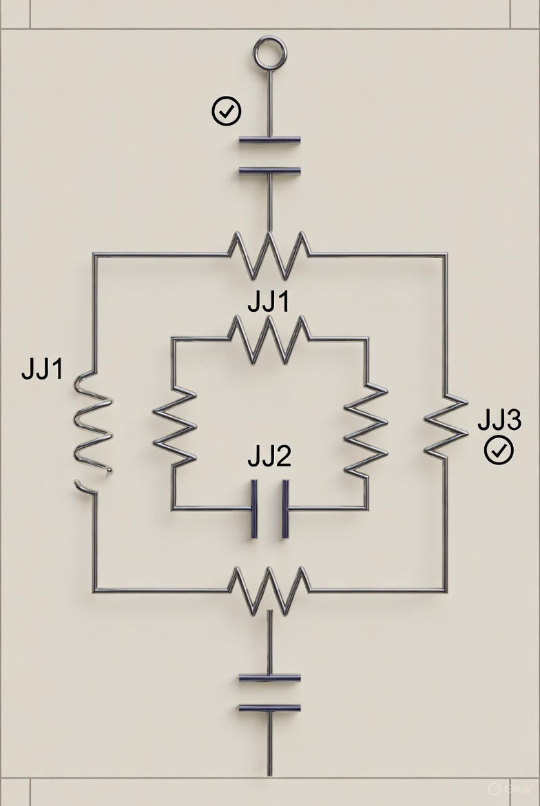

# Dynamical Decoupling:  Introduction

Sunday, November 16, 2025

## Lecturer

Prof. William Oliver, MIT

[Video lecture](https://courses.xpro.mit.edu/learn/course/course-v1:xPRO+QCRx2+R13/block-v1:xPRO+QCRx2+R13+type@sequential+block@9affab3cccb347b29b95f4fedafc0737/block-v1:xPRO+QCRx2+R13+type@vertical+block@0294c8db42bd454f9d14dd52dc10b520)

## Error Mitigation for Stochastic Noise

- Focus on error mitigation strategies that address stochastic noise.

- __stochastic noise__ - a _random_ fluctuation of a parameter that is coupled to a qubit.  It can cause _decoherence_ in a couple of ways.

### Relaxation to Ground State

- A qubit in the exicited state $\ket{1}$ can __relax__ to its ground state $\ket{0}$ by _emitting_ energy to its environment.

- This spontaneous flip from $\ket{1}$ to $\ket{0}$  contributes to decoherence because it destroys phase information.

    - Relaxation time, $T_1$

    - Relaxation rate, $\Gamma_1$:

        $\Gamma_1 = \frac{1}{T_1}$

    - Due to Bloch/Lindbald equations, relaxation affects populations at a rate of $\frac{1}{T_1}$, but coherence at half that on average, $\frac{1}{2T_1}$

### Bloch Vector at Equator

At the equator, two things can happen to a Bloch vector:

1. __Decoherence__

    - Decoherence time, $T_2$

    - Decoherence rate, $\Gamma_2$

        $\Gamma_2 = \frac{1}{T_2}$ 

1. __Dephasing__

    - Dephasing time, $T_\phi$

    - Dephasing rate, $\Gamma_{\phi}$

The decoherence time, $T_2$, is a combination of the dephasing time, $T_\phi$, and the relaxation time, $T_1$:

$\Gamma_2 = \frac{1}{T_2} = \frac{1}{2T_1} + \frac{1}{T_\phi}$

If there is no dephasing, ${T_\phi}$, then:

$T_2 = 2T_1$

### Reversibility of Dephasing Errors

Energy relaxation processes are generally _irreversible_.

Dephasing processes may be coherent and, therefore, _reversible_.

### What does "coherent" mean?:

The qubit interacts in a deterministic and time-independent (or very slow variance) with the environment.

The interaction is _not_ random or stochastic.

Coherent dephasing errors can be mitigated by using dynamical decoupling pulse sequences, a type of _passive_ error suppression. 

## Lacrosse - Passive vs. Active Error Supression

### Cradling the Stick - Dynamical Error Suppression

When a lacrosse player runs down the field, their body moves up and down and side to side.  This motion is imparted to the stick they are holding in their hands.

If the player merely holds the stick in front of them, their body motion can cause the ball to fall out of the basket.

But, if they cradle the stick back and forth in their hands as they run, the cradling motion keeps the ball from falling out of the basket.  Importantly, players do this out of habit, without even thinking about it.

By cradling the stick back and forth, players _decouple_ the ball from the _noise_ generated by their running.

### Picking a Ball Off the Ground - Active Error Suppression

A defender attacks from behind and knocks the ball out of the player's basket.  The ball falls to the ground.  The player must find the ball and pick it up again with his basket.

This is an example of _active_ error suppression.

## Superconducting Flux Qubit

Time: 3:06

How does dynamical error suppression work with a qubit?

### Superconducting Qubits

There are three main families of superconducting qubits:

1. flux qubit

2. charge qubit

3. phase/transmon qubit

### What is a superconducting loop?

1. A superconducting loop is a ring made of _special metal_ that is cooled to a very low temperature.

  - What special metal?

    - aluminum, or

    - niobium    

  - How low is the temperature?

    - < 1 Kelvin (~ -272°C)

    - often a few millikelvin (0.01 - 0.02K)

    - colder than outer space!

1. At this cold temperature, electricity can low through the metal forever with _no resistance_.

  - Why is no resistance important?

    - Any tiny resistance would slowly kill the circulating current and destroy the quantum information.

1. Without resistance, once a current starts going around the loop, it never stops.  This is called a __persistent current__.

1. The never-ending current creates a tiny magnetic field (magnetic flux) that stays inside the loop.

### How does a flux qubit work?

A __flux qubit__ stores quantum information in the _direction_ of persistent current circulating in a superconducting loop.

A qubit has __two stable states__ distinguished by the direction of a tiny persistent current flowing _clockwise_ or _counterclockwise_ in the loop.

The two current directions produce slightly different _magnetic fluxes_ through the loop, typically differing by about one-half of a flux quantum.

### How is a flux qubit made?

The standard implementation uses a superconducting loop interrupted by three Josephson junctions:

    JJ1                 JJ2
       ┌───────╳───────┐
       │               │
       │               ╳   ← JJ3 (smaller, usually α ≈ 0.6–0.8)
       └───────╳───────┘

Here is a basic diagram:

### Qubit Dephasing

Because state $\ket{1}$ is at a higher energy than state $\ket{0}$, $\ket{1}$ accrues phase at a faster rate:

$\alpha\ket{0} + \beta\ket{1} = \alpha\ket{0} + \beta e^{i\phi(t)}\ket{1}$

where:

$\phi(t) = \frac{E_{01}}{\bar{h}}t$

### Filter Function

The __filter function__ depends on the _pulse sequence_ that we apply to the qubit.

It serves to filter, or _window_, the noise.

## Summary

1. Noise seen by a qubit will drive _fluctuations_ in the energy levels and lead to dephasing.

2. The _noise spectrum_ itself can be shaped by a filter function related to the pulses applied to the qubit.